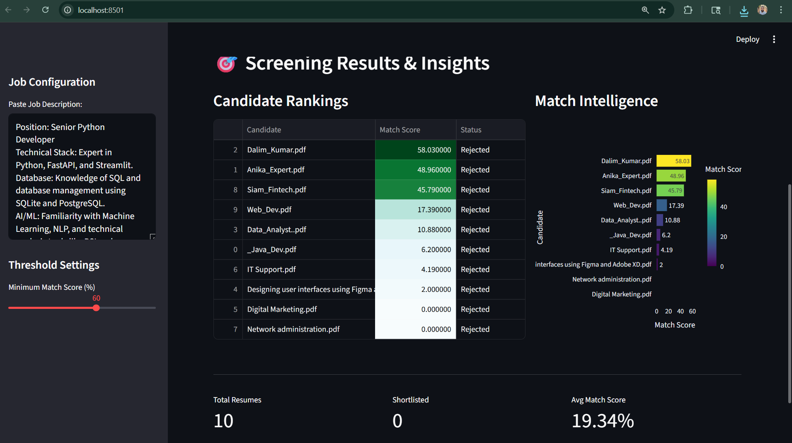

# 🚀 AI-Powered Automated Resume Screening Tool


### 🎯 Overview
Recruiters often face the daunting task of manually scanning hundreds of resumes. This **Automated Resume Screening Tool** is an NLP-driven solution that leverages **TF-IDF Vectorization** and **Cosine Similarity** to mathematically rank candidates based on how well their profiles match a specific Job Description.

---

### ✨ Key Features
*   **Multi-Format Support**: Seamlessly extracts text from **PDF** and **DOCX** files.
*   **NLP Intelligence**: Uses advanced text cleaning and TF-IDF to identify semantic relevance.
*   **Interactive Dashboard**: A professional UI built with **Streamlit** to manage job configurations and uploads.
*   **Dynamic Visualizations**: Real-time **Plotly** bar charts to compare candidate match scores.
*   **Smart Filtering**: Adjustable threshold slider to instantly shortlist or reject candidates.

---

### 🛠️ Tech Stack
*   **Language**: Python 3.11
*   **Libraries**: 
    *   `Scikit-learn` (NLP & Vectorization)
    *   `Pandas` & `NumPy` (Data Processing)
    *   `Plotly` & `Matplotlib` (Visual Intelligence)
    *   `pdfplumber` & `python-docx` (File Parsing)
*   **UI Framework**: Streamlit

---

### 📁 Project Structure
```text
Automated-Resume-Screening-Tool/
├── data/
│   ├── resumes/           # Sample PDF/Docx resumes
│   └── job_description.txt # Target JD
├── images/                # Visual proofs and dashboard screenshots
├── src/
│   ├── app.py             # Streamlit Dashboard UI
│   └── processor.py       # Core NLP and Ranking Engine
├── .gitignore             # Git exclusion rules
├── README.md              # Project documentation
└── requirements.txt       # Environment dependencies

🚀 Getting Started1. Clone the Repository:Bash
git clone Shttps://github.com/dalimkumar452-sudo/Automated-Resume-Screening-Tool.git
cd Automated-Resume-Screening-Tool

2. Setup Virtual Environment:Bash
python -m venv .venv
# Activate on Windows:
.venv\Scripts\activate

3. Install Dependencies:Bash
pip install -r requirements.txt

4. Run the Dashboard:Bash
streamlit run src/app.py

### 📊 Results & Insights
Below are the insights generated by the tool during a simulation.


📊 Results & ScreenshotsBelow are the insights generated by the tool during a simulation of 10 candidates against a Senior Python Developer role:Screenshot TypeDescriptionRankings TableCandidates sorted by Match Score with Shortlist status.Match IntelligencePlotly horizontal bar chart showing semantic scores.Threshold UIDynamic filtering at 40%, 50%, and 60% levels.(Note: Please refer to the ./images/ folder for high-resolution captures including shortlisted_60.png.)🛡️ Core MethodologyThis project uses Term Frequency-Inverse Document Frequency (TF-IDF) to convert text into numerical vectors. By calculating the Cosine Similarity between the Job Description vector and Resume vectors, we ensure that the ranking is based on topical relevance rather than just keyword counting.
# 🚀 AI-Powered Automated Resume Screening Tool

<p align="center">
  
</p>

---

### 🔗 Live Demo
> **Live Demo:** [Coming Soon - Link will be here after Streamlit Cloud Deployment]

### 🎯 Project Overview
This project is an NLP-driven solution to automate the resume screening process. It uses **TF-IDF Vectorization** and **Cosine Similarity** to rank candidates based on a Job Description.

---

### 🛠️ Installation & Setup
Follow these steps to run the project locally:

**1. Clone the Repository:**
```bash
git clone https://github.com/dalimkumar452-sudo/Automated-Resume-Screening-Tool.git
cd Automated-Resume-Screening-Tool

👨‍💻 Author Dalim Kumar

Software Developer

GitHub: @dalimkumar452-sudo

LinkedIn:  linkedin.com/in/dalim-kumar-612038402